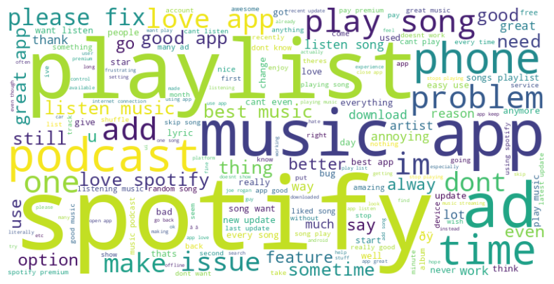

# Spotify Review Sentiment Analysis using RNN and LSTM

## Overview
This project performs sentiment analysis on Spotify user reviews to classify them as **Positive** or **Negative**. The study compares the performance of two Deep Learning architectures:
1.  **RNN (Recurrent Neural Network)** with GloVe Embeddings.
2.  **LSTM (Long Short-Term Memory)** with GloVe Embeddings.

The goal is to determine which architecture better captures the context of user feedback, especially in handling long-term dependencies in text.



## Dataset
* **Source:** Spotify App Reviews
* **File:** `data/Spotify_DATASET.csv`
* **Size:** ~51,000 reviews (subset used: 80% train / 20% test).
* **Features:**
    * `Review`: Text content of the user feedback.
    * `label`: Sentiment label (`POSITIVE` or `NEGATIVE`).

## Model Architecture
The solution is built using **TensorFlow** and includes the following pipeline:
1.  **Text Preprocessing:** Tokenization and padding sequences.
2.  **Embedding Layer:** Pre-trained GloVe vectors.
3.  **LSTM Layer:** Captures long-term dependencies in the text sequence.
4.  **Dense Layers:** Fully connected layers for final classification.
5.  **Output Layer:** Sigmoid activation function for binary classification (0 or 1).

## Installation & Usage

1.  **Clone the repository**
    ```bash
    git clone [https://github.com/citakamaliaa/spotify-review-lstm.git](https://github.com/citakamaliaa/spotify-review-lstm.git)
    cd spotify-review-lstm
    ```

2.  **Install dependencies**
    ```bash
    pip install -r requirements.txt
    ```

3.  **Run the Notebook**
    Open `notebooks/Spotify-Review-RNN-LSTM.ipynb` in Jupyter Notebook or Google Colab to see the training process and evaluation results.

## Results
The LSTM model was evaluated on a test set, comparing the **Actual Sentiment** vs. **Predicted Sentiment**.

To ensure the best performance, this project compared a standard **Recurrent Neural Network (RNN)** against the **Long Short-Term Memory (LSTM)** architecture.

The results show that the **LSTM model is superior**, achieving higher accuracy and significantly lower loss, making it the final choice for this sentiment analysis task.

| Metric | RNN (Baseline) | LSTM (Proposed Method) |
| :--- | :---: | :---: |
| **Training Accuracy** | 85.35% | **87.07%** |
| **Training Loss** | 0.5268 | **0.4135** |
| **Test Accuracy** | 85.14% | **86.60%** |

### Key Findings
- **Accuracy:** The LSTM model achieved a **1.5% improvement** in test accuracy compared to the standard RNN.
- **Stability:** The LSTM model had a much lower loss (0.41 vs 0.52), indicating it was more confident and consistent in its predictions.
- **Efficiency:** Surprisingly, the LSTM model trained faster in this environment (4ms/step), likely due to better optimization in the TensorFlow/Keras backend for LSTM layers.

*(See the notebook for the confusion matrix and accuracy plots)*.

## References
* [1] P. Cen, K. Zhang, and D. Zheng, "Sentiment Analysis Using Deep Learning Approach," 2020.
* [2] Spotify User Reviews Dataset (Kaggle).

## License
This project is licensed under the MIT License.
